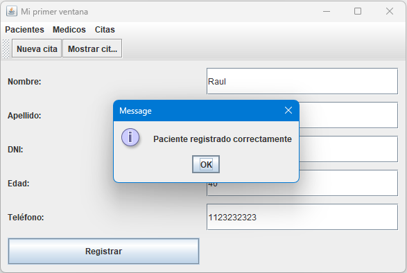
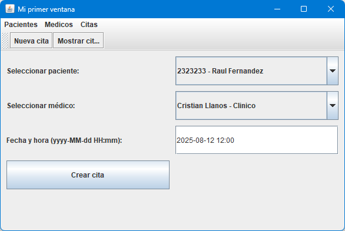
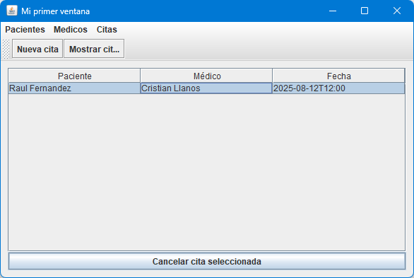

# 🏥 Sistema de Turnos Médicos

Este proyecto es una aplicación de escritorio desarrollada en Java, orientada a gestionar turnos médicos. Permite registrar y visualizar pacientes, médicos y citas, siguiendo el patrón de diseño **MVC (Modelo - Vista - Controlador)**.

> Proyecto académico desarrollado para la materia _Programación 2_  
> Universidad de Ciencias Empresariales y Sociales (UCES)

---

## ⚙️ Tecnologías utilizadas

- Lenguaje: **Java**
- Interfaz gráfica: **Swing**
- Paradigma: **Programación Orientada a Objetos**
- Patrón de diseño: **MVC**
- IDE: **Visual Studio Code**

---

## 📁 Estructura del proyecto

```plaintext
src/
├── modelo/         # Entidades del dominio: Paciente, Médico, Cita...
├── vista/          # Interfaz gráfica (Swing)
├── controlador/    # Lógica de negocio y coordinación entre modelo/vista
└── Principal.java  # Clase principal que inicia la aplicación
```

---

## 🚀 Cómo ejecutar el proyecto

1. Clonar el repositorio:

```bash
git clone https://github.com/ElenaGonzalez2000/Proyecto-Gestor-de-Citas-Medicas.git
```

2. Importar el proyecto en tu IDE (VS Code, NetBeans, IntelliJ).

3. Ejecutar la clase `Principal.java`.

---

## 🧠 Funcionalidades

- Registrar médicos y pacientes
- Crear, visualizar y cancelar citas médicas
- Paneles visuales para gestión individual de cada entidad
- Separación de responsabilidades por capas (MVC)

---

## 📸 Capturas

### 👤 Registro de paciente



### 📅 Crear cita médica



### 📋 Ver y cancelar citas



---

## 📄 Licencia

Este proyecto es de uso académico. Podés usarlo como base para tus propios desarrollos o estudios.

---

## 🙋‍♀️ Sobre mí

👩‍💻 Proyecto realizado por **Elena González**  
📚 Estudiante de Programación de Sistemas (UCES)  
📧 elena.eig@outlook.com  
🌐 [LinkedIn](https://www.linkedin.com/in/elenagonzalez2000/)
